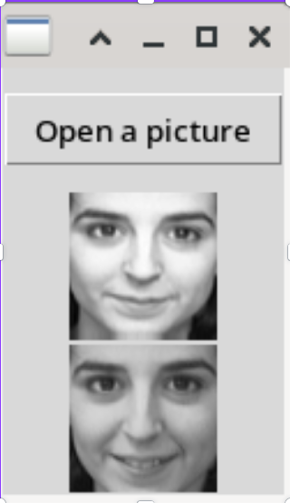

# Python Facial Recognition Project

## Project Description

This facial recognition project has been developed using Python and various libraries, such as torch and other image processing tools. The main goal of this project is to implement a robust and accurate facial recognition system capable of identifying and recognizing faces from images or real-time video streams.

## Features

1. **Face Detection:** Utilizing face detection algorithms to locate analyze a face in a picture.
3. **Model Training:** Comparaison between dataset persons and current picture to determine if the person is in the dataset
4. **Model understanding:** Comprehension of input, if the person is in the dataset it shows another picture of the person else show a picture of the person who most resembles.

## Prerequisites

Make sure to have the following libraries installed before running the project:
```bash
pip install numpy
pip install torch
pip install sklearn
pip install matplotlib
pip install tk
```

## Dataset

The `Olivetti faces` dataset comes from the sklearn library and includes 40 different person and 10 images per person, making a total of 400 images.

# Results

<div style="display: flex; justify-content: space-around; align-items: center;">
  <div>
    <p>If the person is found in the dataset:</p>
    
  </div>
  
  <div>
    <p>If this is not the case:</p>
    
  </div>
</div>

# Colaborators
- [Romain CHEVALLIER](https://github.com/rchevallier1234)
- [Adam LESAGE](https://github.com/AdamLesage)
